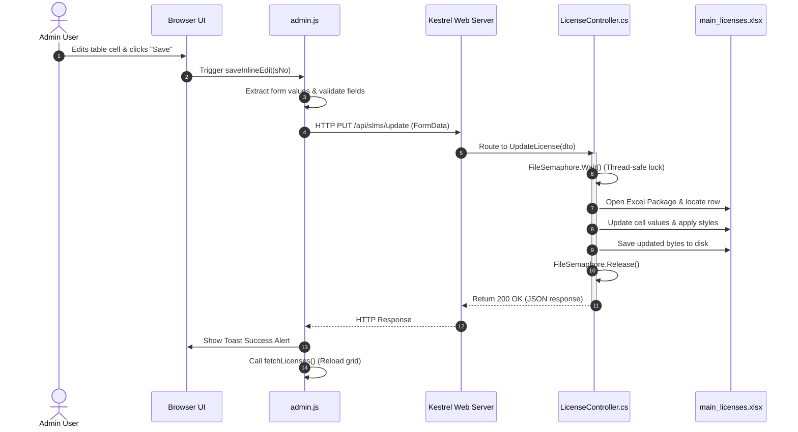

# SLMS - Statutory License Management System

> [!NOTE]  
> The source code and database of this project are hosted in a private repository to comply with corporate security guidelines and protect active statutory documents. This repository acts as a portfolio showcase of the system's design, architecture, and UI.

---

## Presentation Screenshots

### 1. Gateway Landing Portal


### 2. Admin Authentication Login


### 3. Admin Studio - Row-wise Edit Option Enabler


### 4. Admin Studio - Inline Edit-enabled Table


### 5. Guest Portal View


---

##  Key Features

### 1. License Tracking & Dashboard
* **Dynamic Expiry Monitoring:** Monitors days remaining until expiration and highlights rows dynamically with status alerts (Active, Near Expiry, Expired).
* **Admin Studio:** Fully pagination-enabled and sortable table grid supporting search, filtering by act, year, or department, and instant inline edits.
* **Guest Mode:** Read-only access to search and view statutory compliance statuses without modification rights.

### 2. File & Attachment Management
* **Document Attachment:** Support for PDF, PNG, JPG, JPEG, and Excel spreadsheet attachments mapped to individual rows.
* **Inline Deletion:** Admin-restricted single-click document removal that deletes the file from disk and updates the database Excel row instantly.
* **Clean Document Serving:** Query-parameter routing (`/api/slms/document?action=view&fileName=...`) to bypass IIS/Kestrel static file handlers, preventing 404 blockages.

### 3. Bulk Excel Uploader & Templates
* **Strict Validation:** Auto-validates that uploaded sheets have at least 9 columns in the exact matching order (`S No.`, `License No`, `License Title`, `Act`, `Attached Documents`, `Start Date`, `End Date`, `Days until expiry`, `Remarks`). If the order or naming is changed, the file is rejected with clear logs.
* **Static Templates:** Server-stored template spreadsheets served directly from `data/sample_file.xlsx`.
* **Mock Seeding:** Generates a 30-row sample Excel sheet under `data/old_data/sample_import_licenses.xlsx` on first boot for validation testing.

### 4. Targeted Backup & Archives
* **Filtered Zipping:** Packs `main_licenses.xlsx` and only the PDF/image documents physically referenced in the active database (excluding templates or orphan files).
* **Dual Backups:** Automatically saves a timestamped copy of the ZIP archive inside the server's `data/old_data/` folder and streams the backup file directly to the admin's browser.

---

##  Technology Stack
* **Backend:** ASP.NET Core Web API (.NET 8.0)
* **Office Integration:** EPPlus (Excel file manipulation)
* **Frontend:** HTML5, CSS Variables, Vanilla ES6+ JS
* **Integrations:** SheetJS (XLSX browser parsing), jsPDF & jsPDF-AutoTable (PDF reporting)

---

##  Directory Layout
```text
E:\slms\
├── Controllers\
│   └── LicenseController.cs    # REST Endpoints (CRUD, Uploads, Imports, Backups)
├── wwwroot\
│   ├── css\
│   │   └── style.css           # Modern corporate styles & custom scrollbars
│   ├── js\
│   │   ├── admin.js            # Admin controller, pagination, and event handlers
│   │   └── guest.js            # Guest controller, search filters, and view-only grid
│   ├── admin_dashboard.html    # Admin view interface
│   ├── guest_dashboard.html    # Guest view interface
│   └── slmsindex.html          # Gateway & login page
├── data\
│   ├── main_licenses.xlsx      # Master spreadsheet database
│   ├── sample_file.xlsx        # Excel template download
│   ├── created_documents\      # Stored PDF/Image attachments
│   └── old_data\               # Historical database backups & mock seed sheets
├── Program.cs                  # Server startup, CORS, and dual-stack bindings
├── slms.csproj                 # MSBuild configuration
└── README.md                   # System documentation
```

---

##  System Execution Sequence Diagram



---

##  Local Development Setup
1. **Prerequisites:** Install [.NET 8.0 SDK](https://dotnet.microsoft.com/en-us/download/dotnet/8.0).
2. **Clone/Unzip:** Navigate to the project root directory.
3. **Restore & Build:**
   ```bash
   dotnet restore
   dotnet build
   ```
4. **Run Server:**
   ```bash
   dotnet run
   ```
   * The server runs locally and binds to:
     * IPv4: `http://localhost:8080` (or `http://127.0.0.1:8080`)
     * IPv6: `http://[::]:8080`
5. **Open Frontend:** Open `wwwroot/slmsindex.html` in your browser (directly or via a dev proxy like Live Server on port 5500/5501).

---

##  IIS Production Deployment (Port 802)
1. **Install Hosting Bundle:** Install the [ASP.NET Core IIS Hosting Bundle](https://dotnet.microsoft.com/en-us/download/dotnet/8.0/runtime) on the server machine.
2. **Publish Application:** Compile in Release mode:
   ```bash
   dotnet publish -c Release -o C:\publish\slms
   ```
3. **Configure IIS Site:**
   * Create a new website pointing to the publish directory.
   * Bind to your production port (e.g. **Port 802**).
   * Set the Application Pool to **No Managed Code**.
4. **Set Permissions (Important):**
   * Give **Modify & Write** permissions for the **`data/`** directory to the IIS application pool identity (`IIS_IUSRS` or `IUSR`). This permits document saves, edits, and automated ZIP backups to execute cleanly.

---

##  Technical Challenges & Resolution Log

Here is a summary of the technical hurdles resolved during the development of SLMS:

### 1. Loopback Address Refusal (ERR_CONNECTION_REFUSED)
* **Problem:** In .NET, Kestrel default interface binds target IPv4 (`0.0.0.0`) only. If web proxies or browsers attempt to request resources via local IPv6 (`::1`), the connection gets refused.
* **Resolution:** Bound the Kestrel server in `Program.cs` explicitly to both IPv4 and IPv6 loops:
  ```csharp
  app.Urls.Add("http://0.0.0.0:8080");
  app.Urls.Add("http://[::]:8080");
  ```

### 2. Static File Interception on PDF Routes (404 Not Found)
* **Problem:** Requesting routes ending in a file extension (e.g., `/api/slms/document/view/lic.pdf`) matched standard WebKit static file filters. The web server intercepted the call inside the static file pipeline before it reached the controller, throwing a blank 404 because the file wasn't inside `wwwroot`.
* **Resolution:** Redefined routing to use query parameters:
  `GET /api/slms/document?action=view&fileName=lic.pdf`
  Since the URL does not end in a suffix file extension, static middleware ignores the call and lets the controller handle it directly.

### 3. Non-Nullable Required Type Validation (400 Bad Request)
* **Problem:** In .NET 8, non-nullable reference properties (e.g., `public string Remarks { get; set; }`) inside request models are validated as `[Required]` by the ASP.NET Core binder. Saving rows with blank remarks blocked the entire save request with a validation error.
* **Resolution:** Marked optional model fields as nullable strings (`string?`) inside the `License` and `LicenseDto` models:
  ```csharp
  public string? Remarks { get; set; } = string.Empty;
  public string? AttachedDocumentPath { get; set; } = string.Empty;
  ```

### 4. Hidden Horizontal Table Scrollbars
* **Problem:** Custom WebKit scrollbar rules set to `display: none` hid the horizontal scrollbar track, preventing mouse and touchpad horizontal drag.
* **Resolution:** Removed the table wrapper from the scrollbar hiding rule in `style.css` and added a custom styled scrollbar scroll track.
